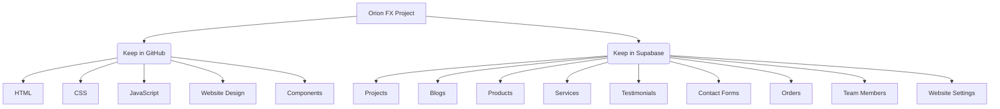

# Orion FX Project Setup & Working Procedure

This document outlines the project structure, data separation guidelines, and database schemas for Orion FX.

## Development & Deployment Strategy



### Keep in GitHub (Static Assets & Logic)
- **HTML**: Core page structures (`index.html`, admin pages, policy pages).
- **CSS**: Styling files (`css/`).
- **JavaScript**: Front-end behavior and API integration logic (`js/`).
- **Website Design / Assets**: Static design resources and icons.
- **Components**: Reusable code snippets and templates.

### Keep & Manage in Supabase (Dynamic Data & Settings)
- **Projects**: Portfolio entries.
- **Blogs**: Published articles and posts.
- **Products**: Available offerings/services.
- **Services**: Service list and descriptions.
- **Testimonials**: Customer reviews.
- **Contact Forms**: Submitted inquiries.
- **Orders**: Customer requests or orders.
- **Team Members**: Bios and profile data.
- **Website Settings**: Dynamic configurations (e.g., alert banners, contact info).

---

## Database Schemas (Supabase)

### 1. `projects` Table
For Orion FX portfolio and projects:

| Field | Type | Description |
|---|---|---|
| `id` | `uuid` | Primary Key |
| `project_name` | `text` | Name of the project |
| `client_name` | `text` | Client name |
| `category` | `text` | e.g., Web Design, Web App |
| `description` | `text` | Project description |
| `technologies` | `text[]` / `jsonb` | Array or JSON of technologies used |
| `project_url` | `text` | Link to live project |
| `github_url` | `text` | Link to source repository |
| `featured_image`| `text` | URL of the cover image |
| `gallery_images` | `text[]` / `jsonb` | URLs of additional gallery images |
| `completion_date`| `date` | Project completion date |
| `status` | `text` | e.g., Draft, Completed, Ongoing |
| `featured` | `boolean` | Display in featured section |
| `created_at` | `timestamp` | Time created |

### 2. `blogs` Table
For managing articles and blog posts:

| Field | Type | Description |
|---|---|---|
| `id` | `uuid` | Primary Key |
| `title` | `text` | Blog post title |
| `slug` | `text` | URL slug (unique) |
| `category` | `text` | Blog category |
| `featured_image`| `text` | URL of the cover/banner image |
| `content` | `text` | Rich text / Markdown / HTML content |
| `author` | `text` / `uuid` | Author details or reference |
| `status` | `text` | e.g., Draft, Published |
| `published_at` | `timestamp` | Publication timestamp |
| `created_at` | `timestamp` | Creation timestamp |

---

## Directory Structure

```
/admin
├── index.html
├── blogs.html
├── leads.html
├── analytics.html
├── settings.html
├── css/
│   └── admin.css
├── js/
│   ├── dashboard.js
│   ├── blogs.js
│   └── analytics.js
└── assets/
    ├── icons/
    └── images/
```