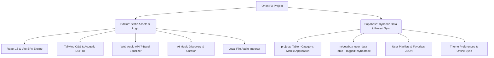

# MyBeatBox Studio — Orion FX Mobile Application

> High-performance acoustic mobile audio workstation, playlist curator, and real-time DSP parametric equalizer built with React 18, TypeScript, Tailwind CSS, Web Audio API, and Supabase.

---

## 🏗️ Orion FX Ecosystem & Architecture

MyBeatBox is structured according to the **Orion FX Project Setup & Working Procedure** (deployed under the **Mobile Application** category on [orionfx.net](https://www.orionfx.net/)).



---

## 📁 Directory Structure & File Map (`/mobile-apps/MyBeatBox/`)

```
/mobile-apps/MyBeatBox/
│
├── public/                          # Static public assets (icons, manifests)
│
├── src/
│   ├── components/
│   │   ├── AudioPlayer.tsx          # Real-time audio engine, Web Audio DSP & 7-band EQ
│   │   ├── MiniPlayer.tsx           # Docked bottom mini player with track controls
│   │   ├── PlaylistWorkspace.tsx    # Interactive playlist manager (create, reorder, export)
│   │   ├── DiscoverStudio.tsx       # AI recommendation generator & artist search
│   │   ├── ThemeSelector.tsx        # 6 studio color themes & live palette editor
│   │   ├── UserProfile.tsx          # Minimalist user profile, settings & Supabase cloud sync
│   │   └── LocalFiles.tsx           # Client-side audio file picker & metadata extractor
│   │
│   ├── lib/
│   │   └── supabase.ts              # Supabase client singleton with 'mybeatbox' project tag
│   │
│   ├── services/
│   │   ├── orionfxSupabase.ts       # Orion FX project registry & user data sync service
│   │   └── geminiService.ts         # AI playlist generation & track discovery
│   │
│   ├── types.ts                     # TypeScript definitions (Song, Playlist, User, Theme)
│   ├── vite-env.d.ts                # Vite environment definitions
│   ├── App.tsx                      # Root workstation layout, tabs & mini player coordinator
│   ├── main.tsx                     # React application bootstrap entry
│   └── index.css                    # Tailwind CSS v4 design system
│
├── supabase-schema.sql              # Supabase SQL schema with project isolation ('mybeatbox')
├── metadata.json                    # Application metadata & permissions
├── index.html                       # HTML5 entry point with responsive mobile viewport
├── package.json                     # Package dependencies & build scripts
├── vite.config.ts                   # Vite build & bundler configuration
├── tsconfig.json                    # TypeScript compiler configuration
├── .gitignore                       # Git ignore rules
├── .env.example                     # Environment variables template (Supabase credentials)
└── README.md                        # Complete project documentation & deployment guide
```

---

## 🔄 End-to-End Workflow

### 1. Database & Project Separation Workflow (`supabase-schema.sql`)
- **Shared Database Isolation**: When using a shared Supabase project (such as *Qanooni Mushawarat* and *Orion FX*), all MyBeatBox records are partitioned with `project_name = 'mybeatbox'`.
- **Showcase Registration (`projects` table)**: Upserts the project under `category = 'Mobile Application'` with live URLs, GitHub repository links, and tech stack tags for [orionfx.net](https://www.orionfx.net/).
- **User Data Synchronization (`mybeatbox_user_data` table)**: Stores user playlists, favorite tracks, and customized theme settings uniquely indexed by `(user_id, project_name)`.

### 2. Client Connection Workflow (`src/lib/supabase.ts`)
- Dynamically initializes the Supabase client using `VITE_SUPABASE_URL` and `VITE_SUPABASE_ANON_KEY`.
- Includes graceful offline fallbacks so the mobile audio player works with local state even without active network credentials.

### 3. Sync & Cloud Service Workflow (`src/services/orionfxSupabase.ts`)
- `registerOrionFxProject()`: Registers MyBeatBox in Orion FX portfolio table.
- `saveUserDataToSupabase()`: Synchronizes local playlists and favorite tracks to Supabase.
- `loadUserDataFromSupabase()`: Restores user cloud data on session load.

### 4. Audio Playback & Parametric Equalizer (`src/components/AudioPlayer.tsx`)
- Web Audio API graph: `AudioElement -> MediaElementAudioSource -> 7 BiquadFilterNodes (60Hz, 170Hz, 310Hz, 600Hz, 1kHz, 3kHz, 12kHz) -> GainNode -> Destination`.
- Includes live visual frequency canvas, preset equalizer modes (Bass Boost, Vocal, Acoustic, Electronic, Classical), and volume level indicators.

### 5. Profile & Settings Hub (`src/components/UserProfile.tsx`)
- Minimalist profile layout:
  - **Identity**: Avatar `◯`, user name (`Faisal`), role (`MyBeatBox User`).
  - **Menu**: Favorites, Listening History, Sync & Storage, Notifications, Appearance, Language, Settings, About MyBeatBox.
  - **Actions**: Direct cloud sync button with Orion FX status feedback and log out control.

---

## 🚀 Getting Started & Deployment

### 1. Clone & Install
```bash
git clone https://github.com/orionfx/mobile-apps.git
cd mobile-apps/MyBeatBox
npm install
```

### 2. Configure Environment (`.env`)
Create a `.env` file from `.env.example`:
```env
VITE_SUPABASE_URL=https://your-project-id.supabase.co
VITE_SUPABASE_ANON_KEY=your-supabase-anon-key
```

### 3. Run Supabase Migration
Copy the contents of `supabase-schema.sql` and run it in your **Supabase SQL Editor**.

### 4. Development Server
```bash
npm run dev
```

### 5. Production Build
```bash
npm run build
```
The output will be generated in `dist/`, ready for static hosting or sub-path deployment on `https://www.orionfx.net/mobile-apps/MyBeatBox/`.

---

## 🛠️ Tech Stack
- **Framework**: React 18 with TypeScript
- **Bundler**: Vite
- **Styling**: Tailwind CSS
- **Audio Engine**: Web Audio API (7-Band Parametric Equalizer & DSP)
- **Backend / Storage**: Supabase (PostgreSQL, JSONB Storage & Row-Level Security)
- **Icons**: Lucide React
- **Platform**: Orion FX Ecosystem ([orionfx.net](https://www.orionfx.net/))
